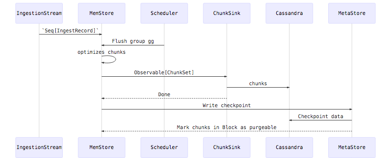

<!-- START doctoc generated TOC please keep comment here to allow auto update -->
<!-- DON'T EDIT THIS SECTION, INSTEAD RE-RUN doctoc TO UPDATE -->
**Table of Contents**  *generated with [DocToc](https://github.com/thlorenz/doctoc)*

- [Coordinator](#coordinator)
  - [Sharding](#sharding)
- [Core](#core)
  - [Ingestion Flow](#ingestion-flow)
- [Cassandra](#cassandra)
- [Kafka](#kafka)
- [Spark](#spark)
- [HTTP](#http)
- [Standalone](#standalone)
- [CLI](#cli)

<!-- END doctoc generated TOC please keep comment here to allow auto update -->

The code is laid out following the different parts and components.

### Coordinator

The Coordinator provides an upper-level, client-facing interface for a FiloDB cluster and
its core per-node components. It also handles shard management, assignment, 
and status handling for ingestion and distributed in-memory querying through an internal PubSub CQRS component.
This is composed of
* A configurable ShardAssignmentStrategy, responsible for assigning or removing shards to/from nodes based 
a defined policy, when state changes occur. It is possible to locate the shard and node coordinator 
to query with either a partition hash or a shard key hash and # bits. 
* [ShardMapper(s)](../coordinator/src/main/scala/filodb.coordinator/ShardMapper.scala)
which keep track of the mapping between shards and nodes for a single dataset. 
For the cluster these are managed by the 
[ShardCoordinatorActor](../coordinator/src/main/scala/filodb.coordinator/ShardCoordinatorActor.scala),
a child of the cluster singleton. On each node, the [NodeClusterActor](../coordinator/src/main/scala/filodb.coordinator/NodeClusterActor.scala)
tracks them locally.

The coordinator also handles different types of streaming data ingestion, and the ability to
subscribe to ingestion stream shard health, state and status.

Each FiloDB node creates a node guardian which creates and supervises the lifecycle of the primary
components: [NodeCoordinatorActor](../core/src/main/scala/filodb.coordinator/NodeCoordinatorActor.scala), 
local proxy to the cluster singleton [NodeClusterActor](../coordinator/src/main/scala/filodb.coordinator/NodeClusterActor.scala), node
metrics, and handles graceful shutdown of the node. 
 
The `NodeCoordinatorActor` is the common external API entry point for all FiloDB operations. 
For each new dataset added the `NodeCoordinatorActor` creates two actors for
the new dataset

* An [IngestionActor](../coordinator/src/main/scala/filodb.coordinator/IngestionActor.scala) which creates and manages sharded ingestion streams of records for that dataset, 
and stores the records in the memstore
* A [QueryActor](../coordinator/src/main/scala/filodb.coordinator/QueryActor.scala)  which translates external query API calls into internal ColumnStore calls.
The actual reading of data structures and aggregation is performed asynchronously by Observables
 
The `IngestionActor` publishes shard ingestion change events to the `ShardCoordinatorActor` which then
broadcasts to all subscribers of that dataset. The `QueryActor` is decoupled from the `ShardCoordinatorActor`
and is subscribed by its parent, the `NodeCoordinatorActor`, to these shard change events and
simply receives them and can act on them as needed.

#### Sharding

* [Shard Coordination](sharding.md#shard_coordination)
* [Shard Assignment](sharding.md#shard_assignment)
* [Shard Event Subscriptions](sharding.md#shard_event_subscriptions)
* [Subscribe To Shard Status And Ingestion Events](sharding.md#subscribe_to_shard_status_events)

### Core

These components form the core part of FiloDB and are portable across data stores.  Subcomponents:

* `binaryrecord` - used for supporting efficient, no-serialization, multi-schema partition keys and ingestion records
* `memstore` - a [MemStore](../core/src/main/scala/filodb.core/memstore/MemStore.scala) ingests records, encodes them into columnar chunks, and allows for real-time querying through the `ChunkSource` API.  The current implementation is a [TimeSeriesMemStore](../core/src/main/scala/filodb.core/memstore/TimeSeriesMemStore.scala) which is designed for very high cardinality time series data.  For each dataset it stores one or more shards, each of which may contain many many thousands of [TimeSeriesPartition](../core/src/main/scala/filodb.core/memstore/TimeSeriesPartition.scala) instances.  MemStores also manage persistence of encoded data via `ChunkSink`s, as well as read-through caching of in-memory chunks from a persistent chunk store.
* `store` - contains the main APIs for persistence and chunk reading, including [ChunkSource](../core/src/main/scala/filodb.core/store/ChunkSource.scala) and `ChunkSink`, as well as the [MetaStore](../core/src/main/scala/filodb.core/store/MetaStore.scala) for metadata persistence.  Most of the APIs are based on reactive streams for backpressure handling.
* `query` - contains aggregation and querying logic built on top of `ChunkSource`s.
* `metadata` - Dataset and Column definitions

FiloDB's [Dataset](../core/src/main/scala/filodb.core/metadata/Dataset.scala) defines the partition and data columns and the row key.  The [MetaStore](../core/src/main/scala/filodb.core/store/MetaStore.scala) defines an API for concurrent reads/writes/updates on dataset metadata.  Each [Column](../core/src/main/scala/filodb.core/metadata/Column.scala) has a `ColumnType`, which has a [KeyType](../core/src/main/scala/filodb.core/metadata/KeyType.scala).  `KeyType` is a fundamental type class defining serialization and extraction for each type of column/key.

#### Ingestion Flow

Also see the [ingeston doc](ingestion.md) for details on recovery and persistence.

### Memory

Contains off-heap memory management as well as columnar encoding/decoding/super fast binary vector logic.

Also contains [OffheapLFSortedIDMap](../memory/src/main/scala/filodb.memory/data/OffheapLFSortedIDMap.scala), an efficient, lock-free, sorted offheap map data structure used to help track our chunks and ensure minimal heap usage. 

### Cassandra

An implementation of ColumnStore and MetaStore for Apache Cassandra.

### Kafka

[Ingestion for FiloDB from Kafka event streams](ingestion.md#kafka_ingestion).

### Spark

Contains the Spark input source for ingesting and querying data from FiloDB.

### HTTP

### Standalone

The standalone module is used for FiloDB real-time direct ingestion (from Kafka) and low-latency querying without Spark, for metrics and event use cases.

### CLI

Contains the client CLI for setting up datasets and connecting with a FiloDB standalone cluster for direct querying using PromQL.