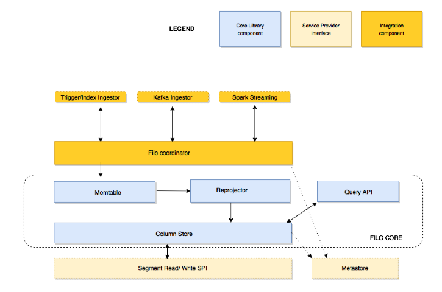

<!-- START doctoc generated TOC please keep comment here to allow auto update -->
<!-- DON'T EDIT THIS SECTION, INSTEAD RE-RUN doctoc TO UPDATE -->
**Table of Contents**  *generated with [DocToc](https://github.com/thlorenz/doctoc)*

- [FiloDB Architecture Overview](#filodb-architecture-overview)
  - [Core](#core)
  - [Cassandra](#cassandra)
  - [Coordinator](#coordinator)
  - [Spark](#spark)

<!-- END doctoc generated TOC please keep comment here to allow auto update -->

## FiloDB Architecture Overview

The code is laid out following the different parts and components.

### Core

These components form the core part of FiloDB and are portable across data stores.
* Memtable: The memtable is a temporary storage for row-format data and is flushed according to a FlushPolicy.
* Reprojector: The Reprojector flushes a set of rows from a Memtable according to a FlushPolicy in order to achieve a desired projection or sort order in the column store. A reprojector outputs Segments.
* ColumnStore: The column store saves and retrieves Segments from the underlying storage.  Includes the ability to merge segments in sorted order.  The core does not implement any particular columnstores, but it contains business logic applicable to all column stores.
* MetaStore: An interface for persistence of database metadata, such as dataset, column, and projection state.

### Cassandra

An implementation of ColumnStore and MetaStore for Apache Cassandra.

### Coordinator

Provides an upper-level, client-facing interface for the core components, and manages the scheduling around the MemTable, Reprojector, flushes, and column store.  Handles different types of streaming data ingestion.

### Spark

Contains the Spark input source for ingesting and querying data from FiloDB.
