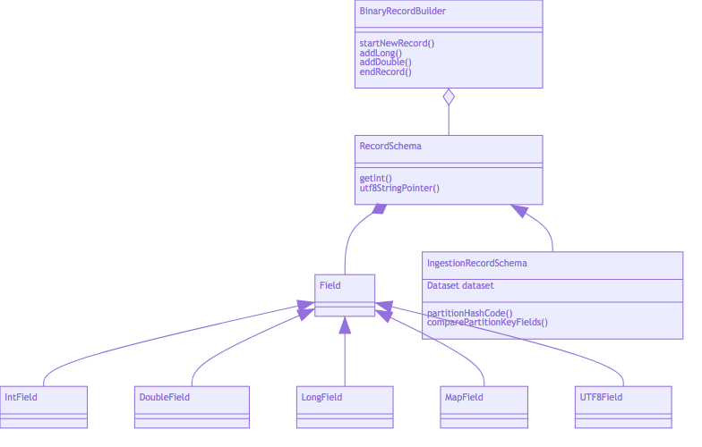

<!-- START doctoc generated TOC please keep comment here to allow auto update -->
<!-- DON'T EDIT THIS SECTION, INSTEAD RE-RUN doctoc TO UPDATE -->
**Table of Contents**  *generated with [DocToc](https://github.com/thlorenz/doctoc)*

- [BinaryRecord Specification v2](#binaryrecord-specification-v2)
  - [Motivation](#motivation)
    - [Differences from v1](#differences-from-v1)
  - [RecordSchema](#recordschema)
    - [Field Access](#field-access)
    - [PartitionKey extraction, hash, comparison](#partitionkey-extraction-hash-comparison)
    - [BinaryRecord creation](#binaryrecord-creation)
    - [Get all optimal container bytes](#get-all-optimal-container-bytes)
    - [Get all full container bytes excluding current container](#get-all-full-container-bytes-excluding-current-container)
  - [Binary format](#binary-format)
    - [Header](#header)
    - [Fixed length fields](#fixed-length-fields)
    - [Hash](#hash)
    - [Variable length fields - UTF8String](#variable-length-fields---utf8string)
    - [Variable length fields - Map field](#variable-length-fields---map-field)
    - [Variable length fields - Histograms](#variable-length-fields---histograms)
  - [RecordContainer: Container format for multiple BinaryRecords](#recordcontainer-container-format-for-multiple-binaryrecords)

<!-- END doctoc generated TOC please keep comment here to allow auto update -->

# BinaryRecord Specification v2

## Motivation

`BinaryRecord` is a serialized record format for representing one ingestion record (that is, one time series event or data sample) consisting of both the partition key and all fields from data columns.  It can also represent just the partition key. Its special characteristics are tuned for ultra efficient memory and CPU usage.

* Can be stored on or off heap
* Capable of working with any valid FiloDB Dataset schema.
* Schema can be defined at runtime.  Needs to be tied into a `RecordSchema`.
* All read and comparison operations including field access should require ZERO on-heap object allocation.  Prefer CPU use over heap allocation.
* Designed for significant improvements in CPU and memory usage compared with traditional serialization protocols such as ProtoBuf
* Designed specifically to aid Prometheus-style time series ingestion

### Differences from v1

* No more explicit bitmask or NA/null field support.  This is not required for time series.  If needed, bitmask support can be implemented on top of existing functionality
* Explicit off heap support
* Preference for using RecordSchema to perform all operations instead of methods on BinaryRecord instances.  This allows us to do away with object allocations for the pointer to the BinaryRecord storage itself
* RecordSchema is integrated with Dataset schema for explicit partition key support
* Redesigned `MapColumn` and map field support.  The v1 version used very expensive Scala `Map`s which require two objects for every key/value label.  Fields are sorted in a map field to ensure ease of comparison and consistent hashing.



## [RecordSchema](../core/src/main/scala/filodb.core/binaryrecord2/RecordSchema.scala)

The `RecordSchema` defines the schema for a `BinaryRecord`, and consists of defined fields or columns.  It is designed to be used as a single instance per dataset schema that can be repeatedly used on millions of `BinaryRecord`s without per-record allocations.

* Schema = a list of fields and the type of each field.  Supported types are:
    - int (32 bits)
    - long (64 bits)
    - double (64 bits)
    - UTF8String (< 64KB total)
    - map** (< 64KB total, UTF8 string to UTF8 string)
    - histograms, which are blobs with a special format
* Data column fields must strictly precede partition key fields
* map field is only allowed as the last field
    - Map field labels are sorted by key
* Number of data column fields preceding partition key fields.  This would be 0 if the schema is used to store partition key only.
* Predefined tag/map keys.  This is used to save memory for commonly used keys.
    - Ex., for Prometheus/time series this might be `__name__, job, instance` etc
    - These should probably be stored offline and repeatedly used during ingestion.  For example, as `DatasetOptions`.  

In general the schema is one of:
* For ingestion: all of the data columns followed by all the partition key fields
* For partition key: just the partition key columns

```scala
class RecordSchema
class IngestionRecordSchema(dataset: Dataset) extends RecordSchema
class PartitionKeyRecordSchema(dataset: Dataset) extends RecordSchema
```

The total length of any field must be less than 64KB.

### Field Access

NOTE: Please see the actual `RecordSchema` class for the accessor methods.  This is just an example to explain principles in the design.

Data column fields need to be accessed for ingestion for adding to each TSPartition.  In addition when a new TSPartition is created, partition key fields need to be accessed (including map field key/values) for index creation.

Offheap `BinaryRecord` accessors:

* `def getInt(recordAddr: Long, index: Int): Int`
* `def utf8StringPointer(recordAddr: Long, index: Int): UTF8String`
* `def getMap(recordAddr: Long, index: Int): OffheapMap`

To ensure no allocations, the `OffheapMap` is actually a value class pointing directly to the offheap memory location.  Similarly `UTF8String` is just a value class wrapping an offheap memory location (64-bit long).

Onheap accessors:

* `def getInt(base: Any, offset: Long, index: Int): Int`

Accessing onheap variable length fields like utf8 strings and maps is problematic because onheap pointers need more than one primitve field and would require an allocation.  To avoid allocations and still facilitate the movement of variable length fields, instead we provide copy semantics, which can be used for example to add a variable length UTF8 string into an offheap `BinaryVector` for more permanent storage.

* `def copyUTF8String(recordBase, recordOffset, index: Int, targetAddress: Long)`

### PartitionKey extraction, hash, comparison

An `IngestionRecordSchema` should be able to do the following to help in identifying the right TSPartition on ingestion:

* Extract the partition key hashcode.  This should already be stored so should be really fast.

        partitionHashCode(base: Any, offset: Long)

* Equality of partition key portion of ingestion record with a partition key-only `BinaryRecord`.  Optimization: in the case of a map field the entire map is compared bytewise (since fields are sorted); actually the entire variable-sized byte areas are compared since the order of fields are the same.

        def partitionMatch(ingestBase: Any, ingestOffset: Long, partKeyBase: Any, partKeyOffset: Long): Boolean

* Extract an ingestion record schema BR into a partition-key-only BR in offheap memory - when we need to create a new TSPartition

        def buildPartKeyFromIngest(ingestBase: Any, ingestOffset: Long, builder: RecordBuilder)

### BinaryRecord creation

`BinaryRecord` creation uses an assistant class, [RecordBuilder](../core/src/main/scala/filodb.core/binaryrecord2/RecordBuilder.scala), which takes a [MemFactory](../memory/src/main/scala/filodb.memory/MemFactory.scala) so they can be created on or offheap.  Since creation of `BinaryRecords` takes a variable amount of space per record, the builder allocates blocks ahead of time and carves out memory within the block as new `BinaryRecord`s are being built.  The builder keeps track of block/memory usage as new `BinaryRecords` are being built.

The builder has add methods that should be called in field order.  The methods will throw if called in the wrong order.  For example, a sequence for an ingestion `BinaryRecord` with the following fields:  `timestamp:long`, `value:double`, `tags:map` where the first two are the data columns and last one is the partition column, would mean the following call sequence:

```scala
builder.startNewRecord(schema)
builder.addLong(timestamp)
builder.addDouble(value)
builder.addMap(tags)
val memory = builder.endRecord()
```

Records of different schemas may be added using the same builder.

Keys in maps are supposed to be very short (<= 127 bytes).  Use of predefined keys helps save space.

A different builder should be used for each different dataset schema and also per thread or per stream/Observable, but should be protected from multi-thread access.

### Get all optimal container bytes

```scala
builder.optimalContainerBytes(reset[true|false])
```

The above method returns all the full containers and also the current container's trimmed bytes. Returning the trimmed bytes for the current active container makes this method optimal.

If the method param is true, it removes all the full containers and resets the current container. This helps to reuse the current container instead of creating new container for the next record. Please note that a `RecordContainer` is considered empty only if `numBytes <= 4` since the first 4 bytes is allocated for total length of `BinaryRecord`.

### Get all full container bytes excluding current container

```scala
builder.nonCurrentContainerBytes(reset[true|false])
```

Returns all the full containers and removes the returned full containers from `RecordBuilder` if the input param is true.

## Binary format

### Header

* +0000  4 bytes   total length of `BinaryRecord` not including this length field

### Optional SchemaID

An optional 2-byte schemaID follows the length prefix.  The schemaID is present for partition keys and ingestion records which contain partition keys - it is used to identify the schema to use for ingestion of the record, and for querying, etc.

### Fixed length fields

* Int - 4 bytes - little-endian 32-bit int
* Long - 8 bytes - little-endian Long
* Double - 8 bytes
* utf8 - 4 bytes - offset within BR to var-length UTF8 string area
* map - 4 bytes - offset within BR to map area (with 2-byte length prefix)
* hist - 4 bytes - offset within BR to histogram blob, with 2 byte length prefix

### Hash

An optional hash:
* 4 bytes   32-bit hash of partition key fields (used for quick hash comparison)

### Variable length fields - UTF8String

2 bytes length field followed by actual UTF8 bytes of length bytes

### Variable length fields - Map field

Note that map fields must be presorted before being added.

Note that this is called a "Map" field but is actually just a list of key-value pairs.  Since none of the operations above involve actual lookup by key, O(1) lookup is not needed, plus the usually small number of keys means it is extremely fast to iterate through everything.

* +0000   2 bytes  total length of map field not including these bytes
* +0002   1-byte Length of key #1, or if MSB is set, then preset key field where zzz = preset number (up to 128 presets)
* +0003 to +0003+(keylen1 - 1)   UTF8 bytes for key #1, or no bytes if preset key
* +n      2-byte length of value #1, followed by UTF8 bytes of value string #1

### Variable length fields - Histograms

Histograms are stored as blobs with a 2-byte length prefix and includes the historam bucket definition and compressed bucket values.  Please see [BinaryHistogram](../memory/src/main/scala/filodb.memory/format/vectors/HistogramVector.scala) for more details.

## RecordContainer: Container format for multiple BinaryRecords

A [RecordContainer](../core/src/main/scala/filodb.core/binaryrecord2/RecordContainer.scala) is a container for multiple `BinaryRecords` for ingesting into Kafka, for example.

* +0000   4 bytes  total length of container following these length bytes
* +0004   4 bytes  version and flag word, for future expansion.  For now, upper byte == version, which is currently 1.
* +0008   8 bytes  server timestamp at container creation/reset
* +0016   BinaryRecord 1  (where first bytes indicates its length)
* +0016+n  BinaryRecord 2....