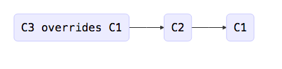
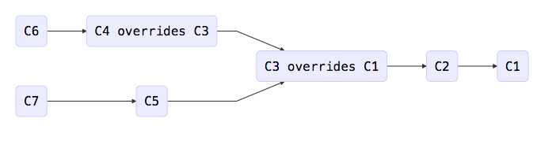

<!-- START doctoc generated TOC please keep comment here to allow auto update -->
<!-- DON'T EDIT THIS SECTION, INSTEAD RE-RUN doctoc TO UPDATE -->
**Table of Contents**  *generated with [DocToc](https://github.com/thlorenz/doctoc)*

- [FiloDB Data Model and Storage Layout](#filodb-data-model-and-storage-layout)
  - [Overall Data Model](#overall-data-model)
    - [A note about "segmentless" changes](#a-note-about-segmentless-changes)
  - [Turning Records into Chunks and ChunkSets](#turning-records-into-chunks-and-chunksets)
  - [Single Writer per Partition](#single-writer-per-partition)
  - [Chunk Index Tree Structure](#chunk-index-tree-structure)
  - [Row Replacement](#row-replacement)
- [CassandraColumnStore](#cassandracolumnstore)
  - [Cassandra Tables](#cassandra-tables)
  - [Query Patterns](#query-patterns)
  - [Alternative Storage Patterns](#alternative-storage-patterns)

<!-- END doctoc generated TOC please keep comment here to allow auto update -->

# FiloDB Data Model and Storage Layout

This guide reflects the new indexing scheme for chunking and row replacement.  In the open source code base it is currently in the `new-storage-format` branch.  It also goes over data layout and Cassandra storage layout.

## Overall Data Model

Perhaps it's easiest by starting with a diagram of how FiloDB stores data.

<table>
  <tr>
    <td></td>
    <td colspan="2">Column A</td>
    <td colspan="2">Column B</td>
  </tr>
  <tr>
    <td>Partition key 1</td>
    <td>Chunk 1</td>
    <td>Chunk 2</td>
    <td>Chunk 1</td>
    <td>Chunk 2</td>
  </tr>
  <tr>
    <td>Partition key 2</td>
    <td>Chunk 1</td>
    <td>Chunk 2</td>
    <td>Chunk 1</td>
    <td>Chunk 2</td>
  </tr>
</table>

Data is modeled and ingested using the two different parts of a record's primary key: the **partition key** and the **row key**.

1. **partition key** - decides how data is going to be distributed across the cluster. All data within one partition key is guaranteed to fit on one node. Similar to the partition key in Cassandra.  May consist of multiple columns with computed columns.
1. **row key**     - acts as a primary key within each partition. Records with the same row key will replace previous ones. Within each chunkset, records are sorted by row key.  Row keys also facilitate range scans within a partition.

### A note about "segmentless" changes

The old design had the notion of a "segment" which were nonoverlapping ranges of records within a partition.  This has been removed due to the difficulty of modeling a good segment key, the additional complexity it incurs, and the tendency to produce very small chunks in streaming applications.  Instead, a user can model both uniqueness and sorting requirements into the row key of a partition.

One implication of having no segments is that partitions can be fairly large, containing potentially a thousand or more chunks per column.  Thus many of the changes in `new-storage-format` are geared towards being able to scan a subset of a partition.

Another implication is that we can scan only one chunkSet of a partition, instead of an entire segment as before.  This can potentially lead to lower latency queries.

## Turning Records into Chunks and ChunkSets

The essential part of FiloDB's ingestion is turning a set of records into columnar chunks for efficient storage, and maintaining metadata to ensure that existing records encoded in chunks can be replaced.  To help this process, a set of metadata is recorded for every set of chunks.

* Let's say you turn 100 records with 5 columns - A, B, C, D, and E - into a set of chunks.   There would be 5 chunks, one each for columns A, B, C, D, and E.   The set of chunks belonging to the same group of records is called a **ChunkSet.**
* Each ChunkSet has metadata called **ChunkSetInfo**.  It has fields for:
    * an ID
    * Number of rows in the ChunkSet.  Every chunk in the ChunkSet must have an equal # of rows
    * First and last keys in the ChunkSet.   Records in a ChunkSet are sorted by row key.
    * The `prevMaxID` - the highest ChunkID considered in this partition when generating the skip list.  Used for multi-writer detection.
    * **skip list -** Records in previous ChunkSets to skip over (row replacement).

The first and last keys are used for row key range searches within a partition, as well as to assist key detection in row replacement.  For example, for the chunkSets below, if there was a range search for keys between "Alpha" and "Doggie", then chunkSets C1 and C2 would contain data, but not C3.

| ID  | numRows | firstKey  | lastKey  |  prevMaxID  | SkipList  |
| :-- | ------: | :-------- | :------- | :---------- | :-------- |
| C1  | 1000    |   Alpha   | Omega    |  -1         |           |
| C2  | 1000    |  Charlie  | Doggie   |  C1         | C1 - [0, 1] |
| C3  | 900     |  Minn     | Seattle  |  C2         |           |  

## Single Writer per Partition

It is assumed that there is only one node performing the chunking and creating ChunkSetInfo's.  FiloDB has routing logic to route records to the correct node based on consistent hashing of record keys.  However, the ChunkSetInfo structure is designed for multi-writer safety and detection.

## Chunk Index Tree Structure

Each new chunk describes what previous chunk rows have been replaced.  Thus, chunk metadatas form a tree or graph structure which point back to previous chunks.  The tree structure tells you what other chunks the new chunk keys have been compared against.

For example, let's say we have three chunks written by one writer, C1, C2, and C3:



C1 is the first chunk written.  It depends on no other chunk.

C2 depends on C1 (has C1 in its `prevMaxID`) and is written after C1.  This dependency means the ingestion has verified all the records in C2 do not overwrite any of the records in C1, according to row key.

C3 depends on C2 which depends on C1.  The ingestion has verified row keys for C3 against both C2 and C1, found that a record overwrites C1 and inserted a ChunkRowSkipIndex.

If there are multiple writers for some reason, then there will be multiple branches in the tree or parallel branches.



If multiple branches are detected, then they must be healed by going back to the split, retrieving row keys for those chunksets, and "linearizing" the chunks again.  Compaction can be one form of healing.

## Row Replacement

To help with detecting previous chunks records that might be replaced, we generate bloom filters for every chunk.  The bloom filter is used to quickly evaluate if previous chunks have any rows that might need to be skipped over.

# CassandraColumnStore

## Cassandra Tables

Three physical Cassandra tables are used to store one logical FiloDB dataset.  The `chunks` table contains the actual columnar chunks:

```
CREATE TABLE filostress.taxi_hour_of_day_chunks (
    partition blob,
    version int,
    columnname text,
    chunkid bigint,
    data blob,
    PRIMARY KEY ((partition, version), columnname, chunkid)
) WITH COMPACT STORAGE
    AND CLUSTERING ORDER BY (columnname ASC, chunkid ASC)
```

The `index` table contains the serialized `ChunkSetInfo` metadata for each chunkSet, the skiplists etc.

```
CREATE TABLE filostress.taxi_hour_of_day_index (
    partition blob,
    version int,
    indextype int,
    chunkid bigint,
    data blob,
    PRIMARY KEY ((partition, version), indextype, chunkid)
) WITH COMPACT STORAGE
    AND CLUSTERING ORDER BY (indextype ASC, chunkid ASC)
```
 
The `filters` table contains serialized bloom filters used for row replacement and rowkey detection.

```
CREATE TABLE filostress.taxi_hour_of_day_filters (
    partition blob,
    version int,
    chunkid bigint,
    data blob,
    PRIMARY KEY ((partition, version), chunkid)
) WITH COMPACT STORAGE
    AND CLUSTERING ORDER BY (chunkid ASC)
```

## Query Patterns

One can limit queries on FiloDB data along two axis.  For the partition key, there are three scanning modes:

1. Single partition
2. Multiple partition
3. Filtered scan of all partitions using a custom function.  For example, the partition key has 3 columns, we want to filter on only one of them.  

Filtered scans are done by doing an all-table scan of the much smaller index table.  The chunk metadata is needed for querying anyhow, and scanning this smaller table returns matching partition keys.

Within a partition, scans can be further filtered by specifying a range of row keys.  The `ChunkSetInfo`s are then used to further filter down to the chunkSets containing the matching chunkIDs to read.  Otherwise, all the chunks from a partition are read.

Only the requested columns in a query are read - this is part of the reason why scanning FiloDB tables are fast. FiloDB issues multiple parallel single-partition reads for chunks - one for each column.  The queries look something like this:

    SELECT chunkid, data FROM $tableString WHERE partition = ? AND version = ? AND columnname = ? AND chunkid IN (....)

## Alternative Storage Patterns

An alternative layout where the clustering key for the `chunk` table included the startKey of a chunkSet, eg `(columnname, startkey, chunkid)`, was tried.  However, this did not improve query speeds.  It turns out that the starting key of a chunkset often did not correlate very well to the query range, and often times the starting key can be an outlier to the rest of the data in a chunkSet.