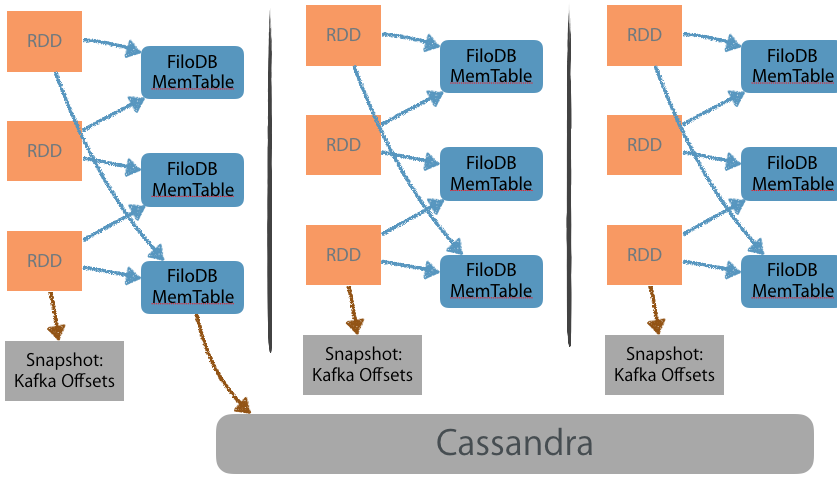

# Exactly Once Ingestion and Error Recovery

What happens if an ingestion node goes down?  How can we guarantee writes of incoming records in the face of failure?

## Overall Strategy 

The biggest thing to protect with FiloDB ingestion is the MemTable state, as the MemTable exists only in memory.  We take advantage of the fact that FiloDB ingestion is idempotent with regard to the (partition key, row key) combination, a property that makes it easy to guarantee exactly-once end to end behavior, since

    exactly-once == at-least-once + idempotent writes

There are some potential shortcuts we can take with regard to the idempotency.

To recover MemTable state, there are basically two strategies.

1. Rely on a persistent input source (such as Kafka) and replay input rows upon failure
    * With every new MemTable created, snapshot tracking info (basically the minimum seqID / offset) to know memtable rows are in flight
    * When a MemTable is successfully flushed, send a notification so we don't need to replay from that minimum seqID anymore
2. Write a Write-Ahead Log (WAL) when the memtable ingests rows so that its contents can be recovered in case of failure

## Scenario: Kafka + Spark Streaming

For Spark Streaming, the idea is to line up the memtable flushes to occur and only occur at the end of a microbatch.  

- At the beginning of the batch, the active memtable should be empty and there should be no flushing memtable.
- Spark streaming app feeds data through FiloDB library which routes it to the right Executor node via Akka Cluster.  Active memtable starts filling up
- At the end of the batch, driver library of FiloDB tells all memtables to flush

For this to happen we need these settings:

- `filodb.memtable.max-rows-per-table` set to higher than the max # of rows that could come in for one microbatch
- `filodb.memtable.noactivity.flush.interval` set to much higher than the microbatch interval, for example `1d`
- `flush_after_write` option in DataFrame.write should be set to true, or not set (which defaults to true)

Note that the memtable will keep filling up memory, so be sure to watch memory usage as well as the batch interval.

If a failure occurs, Spark will recover the Kafka offsets to read from in order to replay the records for the last failed batch.  FiloDB takes care of replacing rows written in the previous batch try so no extra data ends up being ingested. (See below for ways of skipping writes though)

### Idempotency Shortcuts

If the memtable/partition is large, we might potentially be replacing lots of identical rows.  Replacing rows on disk is fairly expensive, even with FiloDB's mostly append-only design, as previous row keys have to be read from disk.

Shortcut 1:

- For each partition, keep track of the minimum chunkID as the memtable starts flushing.  Basically (dataset, version, partition, minChunkID).
- At beginning of flushing a partition, look up from the `PartitionChunkIndex` all of the chunkSets that have been written where the id >= minChunkID
- Check, for each existing such chunkSet, if the startKey and endKey are both in the memtable, and if the number of keys inclusive between (startKey, endKey) are the same as the ChunkSetInfo.numRows.  If this is true, and the source can guarantee replay of the same rows, then that set of rows has been written already and can be skipped.

This shortcut cannot be used if rows are replayed for replacement.  It also cannot be used if the data underneath has been compacted, though this tends not to be a problem for recently ingested data.

This check for already-written chunks obviously works best if the same memtable windows can be guaranteed.  This is the case when Spark Streaming is set up to flush the memtable only at the batch boundaries.  Otherwise, the rows replayed are not the same, and it is much more difficult to skip chunks -- one would have to rely on the row-by-row replacement system.

## Scenario: Kafka + Independent Reader Processes (or Samza)

In this scenario, there is no Spark but there are individual worker apps reading from Kafka.  They pull data at independent rates, and usually the data is already partitioned coming into Kafka.  The recommendation would be to track offsets at which memtable flushes are happening, and to rewind back to the last offset where a flush commits data to persistent ColumnStore, and replay those records.

- disable the auto FiloDB routing of records across the cluster (Not implemented yet).  This means each app only ingests data from its own Kafka partitions into the FiloDB memtable, making tracking and replays significantly simpler
- Hook into FiloDB APIs for notifying when a memtable flush finishes (Not implemented yet)
- Send the Kafka offset as the seqID of each batch of incoming rows
- Persist the Kafka offsets for the active and flushing memtables.

## Scenario: Batch Ingestion

The problem with batch ingestion is that you typically have to replay the entire source of data.  This will lead to slow ingests as new rows replacing existing rows causes overhead.  Furthermore skipping rows is tricky because each partition writes to memtables and flushes them independently; there is no coordination like there is in Spark Streaming.

Ways of dealing with this (none implemented):
- Make row replacement more efficient?
- If batch loading the entire table, just delete the dataset first (set `SaveMode.OverWrite`)
- If possible, delete partitions that will be ingested beforehand
- It might be possible to extend the "idempotency shortcut" above so that we can detect chunks to skip that have already been ingested.  Maybe persist the first chunkID written of each partition in the entire batch.

Or, actually, perhaps just rely on the MemTable WAL and restart from that point.  The problem is that the batch process might still restart from the beginning.

## Scenario: Other (eg direct reads from Cassandra)

For other scenarios just need to write to the WAL and recover existing memtable state from the WAL.  This assumes no replay whatsoever.