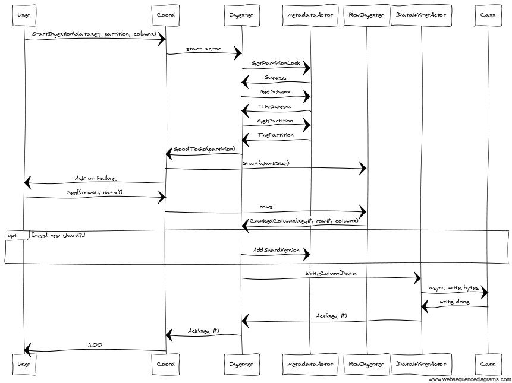

## Ingestion Goals

1. Don't lose any data!  Idempotent at-least-once
2. Backpressure.  Ingest only when ready.
3. Support distributed bulk ingest
4. Efficient ingest and efficient retries
5. Should work for streaming data, including error recovery

NOTE: The ingestion is designed for high-volume ingestion of fewer datasets at a
time, due to the nature of bulk columnar chunk ingestion.  It is not designed
for lots of tiny row ingestions across a huge number of datasets at once.  It is
advised that for lots of datasets, they be ingested a few at a time.

## Use Case - Append-Only Writes

- User divides dataset into independent partitions, sequences input rows
- FiloDB internally shards partitions and tracks row IDs
- Row IDs numbered from 0 upwards, corresponds to partition input stream
- Row IDs are always increasing, unless rewinding for replay / recovery
- Row ID of each column chunk is the first row # of each chunk
- Append-only pattern: write to shard with highest starting row ID
- Regular acks of incoming stream

## Use Case - Random Writes

- Each row may have a different row ID
- Inefficient - cannot easily group chunks of rows together
- Need to worry about replacing existing data
- Best that the row ingester can do is to group successive row IDs together, and reset when it gets something different - or do a sliding window and group everything in the window together
- Also much harder to shard

## Don't Lose Any Data

- Increasing sequence numbers Kafka-style for each row/chunk of ingress stream
- Ack latest committed sequence number
    + Works for any data layout
    + Scalable, works when grouping rows into columnar layout
- On error:
    + Rewind to last committed sequence number (may rely on client for replay)
    + Updates to all state needs to be like CRDTs - repeatable, idempotent
- Sequence number should be independent of row #
    + For appends, they should both increase at the same rate, such that row # = sequence # + (offset)
    + For random writes, no correlation

## Sharding 

See [[ShardingStrategy.scala]] for specific strategies.

Sharding is needed to limit physical row length. Each row stores columnar chunks of rows.
1. Distributing shards of physical row chunks eliminates hot spots
2. Due to columnar nature of storage, reading out rows requires a transpose operation.  This operation requires more memory the longer each physical row is.

Simplest sharding strategy is fixed hashing by row number.  It works for both random and append writes, less state to keep track of.

Sharding is basically a function.  

(Existing shard state, row IDs) -> (New shard state)

More complex sharding strategy can be based on the actual # of bytes written, and adjust subsequent shard size based on previous input.  This is very tricky to get right though, and makes managing shards esp for random writes very complex.

A middle ground is an `EstimatingHashingSharder`.  This uses info from the schema to estimate the number of rows per shard to balance shard size and simplicity. However, since the sharding strategy has to be declared when a partition is created, there is potential for divergence if a lot of columns are added in later versions.

It might be possible to have an adaptive sharder, which adapts the shard length based on the latest writes, but it would only work for appends, and cannot jump forwards or backwards.

## Acking and Backpressure

**Acking** is the ability to confirm that writes happened successfully.

**Backpressure** is a system to slow down writes when the datastore cannot write as quickly as the input source.

Both are needed to make sure every piece of data is ingested, and prevent the system from being flooded.

Currently proposed system is this:
- Source (Kafka or HTTP actor etc.) pulls and pushes data down to ingestion pipe, with a sequenceID
- Ingestion pipe sends back Acks to the Source with the sequenceID of latest completed writes
- Source only continues to pull if the latest sent sequenceID - completed sequenceID is below a certain watermark.

The above pattern works well for our pattern where many IngesterActors (each
representing a separate dataset/partition) are pushing to a common dataWriter
and metadataActor, and may come and go dynamically.  Unlike the Akka streaming
methodology, which requires separate channel for acks and for backpressure, and
would require each writer to register with the downstream, we reuse the response
stream for both acks and backpressure.  Unlike simply using rejection at the
downstream writer, the client also has throttling, preventing flooding.

## Ingestion API

**High-level Row API** - ingest individual rows with a sequence # and Row ID.  A RowIngester groups the rows into chunks aligned with the chunksize and translates into columnar format.
- Also takes care of replaces by reading older chunks and doing operations on it

**Low-level columnar API** - `Columns(rowId: Long, endingSequenceNo: Long, columns: Map[String, ColumnBuilder[_]])`
- Assumed that starting row IDs are already chunk-aligned
- Only for append patterns, does not handle replacements

## Ingestion walk-through



Prerequisites for ingestion:
1. Dataset must be created
2. Columns/schema must be created
3. At least one partition must be created
4. Columns to be ingested must be defined in the schema already

### Current Implementation

Currently the ingestion flow is implemented as a set of actors sending messages to one another.  See the ingestion flow diagram above.

### Akka Streams Implementation

We could potentially implement the ingestion flow as a set of Akka Stream flows.  Akka Streams was at 1.0-M3 as of this writing, so not quite stable yet and still missing docs etc.

```scala
val lowLevelFlow: Flow[ChunkedColumns, Ack] = Source[ChunkedColumns] ~> ingester ~> dataWriter

val httpFlow: Flow[HttpRequest, HttpResponse] = request ~> reqToRows ~> rowIngester ~> ingester ~> dataWriter ~> acksToResponse
```

Some open questions:
1. We want one lowLevelFlow per dataset/partition, but one common dataWriter. How to do that?  Some kind of dynamic merging?
2. Where would we put the ingestion setup (StartIngestion)?  Should the whole thing be modelled as a Flow[Command, Response] where the Command could be UpsertRows etc.? 
3. How can the Acks be incorporated into the flow?