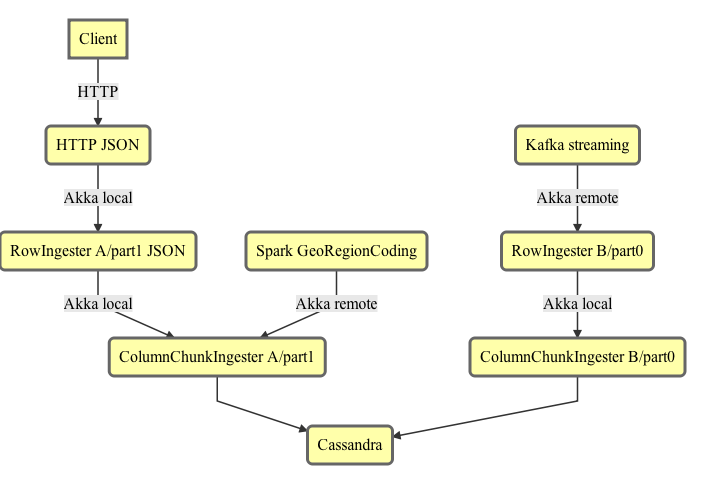

# NOTE: This describes the old ingestion pathway.  The goals are probably still valid, but everything else will be changing dramatically.

## Ingestion Goals

1. Don't lose any data!  Idempotent at-least-once
2. Backpressure.  Ingest only when ready.
3. Support distributed bulk ingest
4. Efficient ingest and efficient retries
5. Should work for streaming data, including error recovery

NOTE: The ingestion is designed for high-volume ingestion of fewer datasets at a
time, due to the nature of bulk columnar chunk ingestion.  It is not designed
for lots of tiny row ingestions across a huge number of datasets at once.  It is
advised that for lots of datasets, they be ingested a few at a time.

## Ingestion Interfaces and Use Cases

### Akka

The Akka API is the lowest-common-denominator ingestion API.  It is a
bidirectional socket interface and used by every other interface (though some interfaces like HTTP will interface in the same JVM) It offers
continuous ACKs to facilitate efficient, streaming at-least-once ingestion, as
well as backpressure.

Recommend using Kryo/Chill for efficient serialization over the wire.

### Streaming ingestion - Kafka

- Fixed schema agreed upon ahead of time per topic
- Append only
- One row per message (or maybe a grouped or chunked set of rows per message, aligned with the chunkSize)
- One Kafka partition per FiloDB dataset partition -- this makes retries, at-least-once very easy
    + Kafka sequence numbers == FiloDB sequence numbers
    + RowID could be inferred from sequence # or separate
- Version number embedded in message, should be monotonically increasing (except for replaying old messages)
- Need to pick row format, could potentially use HTTP JSON row format

KafkaConsumer --> AkkaIngestionAPI

### Streaming use case - Spark Streaming, Samza etc.

This is pretty similar to the Kafka case, but we have to be careful of partitions.  If the stream processor has a different mapping of partitions than Kafka, then it needs to regenerate the sequence IDs and think about how to make retries work well.

Spark Streaming, since it's micro-batches, could possibly work with HTTP interface, or use the Akka interface for efficiency.

### HTTP JSON

Each request would include the following:
- Schema - List of columns to write to
- Name of dataset, partition, and version
- Bool: include RowID in each row?
- Rows, which are JSON arrays corresponding to the schema
    + A RowID should be prepended.  If not prepended, then rows will be assumed to be append and a rowID generated that corresponds to an append

Deletes should not be mixed with appends and replaces, and should go in a separate version, otherwise it would be difficult or impossible to reach the current state of a version without replaying every sequence.

Sequence numbers would be generated for every incoming row starting at 0 for the first row received.  Perhaps one option (for chunking long ingresses into multiple HTTP POSTs) is to let the user specify the sequence number or a starting sequence number.

Concurrent HTTP POSTs to the same dataset and partition are not allowed.

Responses:
- 200, if every sequence number/row was acked
- If an error occurs, the response will include the last successfully acked sequence number
- Timeout handling...

The HTTP endpoint would be part of the FiloDB service and talk locally to the Akka ingestion API.

### WebSockets / HTTP2?

This would look much more like the Akka binary interface - designed for continuous acks and backpressure.

### Computed columns / Spark

Examples of computed columns:
- Geo-region-coding (point data --> containing geometry ID)
- DDLs

The source columns would be read into Spark and the computed results written
back.  While it is possible to use the row-based or HTTP interfaces for this,
for efficiency reasons the best would be for the Spark compute layer to convert
data to columnar chunks using the core FiloDB library, then write the chunks
directly to the `ColumnChunkIngester` low level API over Akka remote socket
connection.

Spark --> columnar chunks -->|Akka| ColumnChunkIngester

## Write Patterns
### Pattern - Append-Only Writes

- User divides dataset into independent partitions, sequences input rows
- FiloDB internally shards partitions and tracks row IDs
- Row IDs numbered from 0 upwards, corresponds to partition input stream
- Row IDs are always increasing, unless rewinding for replay / recovery
- Row ID of each column chunk is the first row # of each chunk
- Append-only pattern: write to shard with highest starting row ID
- Regular acks of incoming stream

### Pattern - Random Writes

- Each row may have a different row ID
- Inefficient - cannot easily group chunks of rows together
- Need to worry about replacing existing data
- Best that the row ingester can do is to group successive row IDs together, and reset when it gets something different - or do a sliding window and group everything in the window together
- Also much harder to shard

## Don't Lose Any Data

- Increasing sequence numbers Kafka-style for each row/chunk of ingress stream
- Ack latest committed sequence number
    + Works for any data layout
    + Scalable, works when grouping rows into columnar layout
- On error:
    + Rewind to last committed sequence number (may rely on client for replay)
    + Updates to all state needs to be like CRDTs - repeatable, idempotent
- Sequence number should be independent of row #
    + For appends, they should both increase at the same rate, such that row # = sequence # + (offset)
    + For random writes, no correlation

## Sharding 

See [[ShardingStrategy.scala]] for specific strategies.

Sharding is needed to limit physical row length. Each row stores columnar chunks of rows.
1. Distributing shards of physical row chunks eliminates hot spots
2. Due to columnar nature of storage, reading out rows requires a transpose operation.  This operation requires more memory the longer each physical row is.

Simplest sharding strategy is fixed hashing by row number.  It works for both random and append writes, less state to keep track of.

Sharding is basically a function.  

(Existing shard state, row IDs) -> (New shard state)

More complex sharding strategy can be based on the actual # of bytes written, and adjust subsequent shard size based on previous input.  This is very tricky to get right though, and makes managing shards esp for random writes very complex.

A middle ground is an `EstimatingHashingSharder`.  This uses info from the schema to estimate the number of rows per shard to balance shard size and simplicity. However, since the sharding strategy has to be declared when a partition is created, there is potential for divergence if a lot of columns are added in later versions.

### Using TOAST tables

@rjmac suggested using PostGres-style TOAST tables.  In this scheme, variable-size columns would be stored in a different location (perhaps separate CF).  Primary candidates would be long strings and geometry objects like polygons. The column would then just consist of a pointer to the variable size stuff. This would allow for predictable sized columns and more manageable reads, making the sharding easier.

## Acking and Backpressure

**Acking** is the ability to confirm that writes happened successfully.

**Backpressure** is a system to slow down writes when the datastore cannot write as quickly as the input source.

Both are needed to make sure every piece of data is ingested, and prevent the system from being flooded.

Currently proposed system is this:
- Source (Kafka or HTTP actor etc.) pulls and pushes data down to ingestion pipe, with a sequenceID
- Ingestion pipe sends back Acks to the Source with the sequenceID of latest completed writes
- Source only continues to pull if the latest sent sequenceID - completed sequenceID is below a certain watermark.
- Ingester also has ability to reject writes if too many writes happen.

The above pattern works well for our pattern where many IngesterActors (each
representing a separate dataset/partition) are pushing to a common dataWriter
and metadataActor, and may come and go dynamically.  Unlike the Akka streaming
methodology, which requires separate channel for acks and for backpressure, and
would require each writer to register with the downstream, we reuse the response
stream for both acks and backpressure.  Unlike simply using rejection at the
downstream writer, the client also has throttling, preventing flooding.

## Ingestion Architecture



Note that there is only essentially one ingestion pipeline per dataset and partition, with the exception of computed columns and materialized view generation.

**RowIngester** - ingest individual rows with a sequence # and Row ID.  A RowIngester groups the rows into chunks aligned with the chunksize and translates into columnar format.
- Translates rows into columnar chunks
- Does schema validation
- One `RowIngester` per (dataset, partition) at a time
- Handles replaces and deletes by translating into columnChunk operations (stateful)
- May verify that deletes don't happen mixed with appends in same version
- May need to cache ingested rows for efficient writes (eg chunk is partially complete, store previous rows so they can be picked up in memory)
- May rely on a schema-independent columnar chunk cache for fast updating or more efficient replace operations

**ColumnChunkIngester** - `Columns(rowId: Long, endingSequenceNo: Long, columns: Map[String, ColumnBuilder[_]])`
- Primary responsibility is writing columnar chunks, updating shard state, and tracking acks and handling errors and retries
    + Has to ensure that acks come back IN ORDER of sequence number
- State: Partition object / shard and version information
    + Therefore, one ColumnChunkIngester writer per partition would be smart
- Does not care about schemas
- Does not care about replaces/deletes - everything is just a chunk write

## Ingestion walk-through


Prerequisites for ingestion:
1. Dataset must be created
2. Columns/schema must be created
3. At least one partition must be created
4. Columns to be ingested must be defined in the schema already

### Current Implementation

Currently the ingestion flow is implemented as a set of actors sending messages to one another.  See the ingestion flow diagram above.

### Akka Streams Implementation

We could potentially implement the ingestion flow as a set of Akka Stream flows.  Akka Streams was at 1.0-M3 as of this writing, so not quite stable yet and still missing docs etc.

```scala
val lowLevelFlow: Flow[ChunkedColumns, Ack] = Source[ChunkedColumns] ~> ingester ~> dataWriter

val httpFlow: Flow[HttpRequest, HttpResponse] = request ~> reqToRows ~> rowIngester ~> ingester ~> dataWriter ~> acksToResponse
```

Some open questions:
1. We want one lowLevelFlow per dataset/partition, but one common dataWriter. How to do that?  Some kind of dynamic merging?
2. Where would we put the ingestion setup (StartIngestion)?  Should the whole thing be modelled as a Flow[Command, Response] where the Command could be UpsertRows etc.? 
3. How can the Acks be incorporated into the flow?