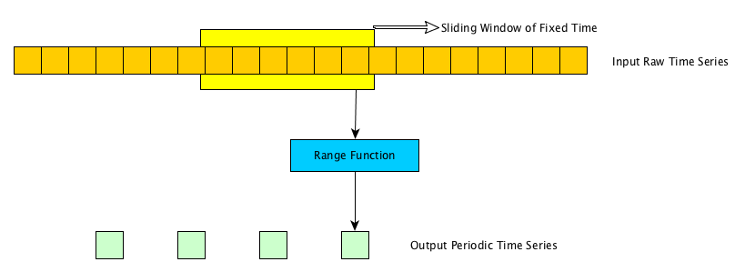

<!-- START doctoc generated TOC please keep comment here to allow auto update -->
<!-- DON'T EDIT THIS SECTION, INSTEAD RE-RUN doctoc TO UPDATE -->
**Table of Contents**  *generated with [DocToc](https://github.com/thlorenz/doctoc)*

- [FiloDB Query Engine](#filodb-query-engine)
  - [Logical Plan](#logical-plan)
  - [Query Results as Range Vectors](#query-results-as-range-vectors)
  - [Execution Plan Constructs](#execution-plan-constructs)
    - [Range Vector Transformers](#range-vector-transformers)
  - [Conversion of `LogicalPlan` to `ExecPlan`](#conversion-of-logicalplan-to-execplan)
    - [Dispatcher Assignment](#dispatcher-assignment)
  - [Example](#example)
  - [Execution Detail](#execution-detail)
    - [Periodic Samples and Range Functions](#periodic-samples-and-range-functions)
      - [Alternate Design Approaches to Consider](#alternate-design-approaches-to-consider)
    - [Aggregation across Range Vectors](#aggregation-across-range-vectors)

<!-- END doctoc generated TOC please keep comment here to allow auto update -->

# FiloDB Query Engine

FiloDB Query Engine allows for distributed orchestration of queries. Queries are processed this way
inside FiloDB:

1. Parse the query string from a syntax such as PromQL into its AST
2. Convert Language specific AST into a FiloDB Logical Plan 
3. Submit the Logical Plan to the Query Engine for execution

The Query Engine internally takes the query through this pipeline for execution:
1. Validate the `LogicalPlan` 
2. Optimize the `LogicalPlan` continuously using configurable rules
3. Materialize the `LogicalPlan` into one or more candidate `ExecPlan`s using shard/cluster health/metadata.
   The load of a FiloDB node, the health of shard replicas etc are all useful information that can be 
   fed to the materializer to enumerate `ExecPlan`s.
4. Apply a cost model for each `ExecPlan`, and pick the one with lowest cost. 
5. Trigger the orchestration of the `ExecPlan` by dispatching the root plan to the cluster
6. Collect from the cluster a `QueryResult` which is a bunch of `RangeVectors`,
    or a `QueryError` in case of a user/internal error.

Note that in the current implementation:
* We do not optimize the logical plan yet.
* We do not enumerate more than one candidate execution plan and cost them. We simply materialize
  one execution plan.
  
Later phases of implementation can enhance the engine to provide the envisioned functionality.

## Logical Plan

The logical plan is a tree of `LogicalPlan` type nodes. The `RawSeriesPlan` node type can be used
for the leaves. It represents extraction of raw data from partitions identified by the filter. 

```
  val raw = RawSeries(from = 1523575055L,
                      to = 1523785055,
                      filters = Seq(ColumnFilter(ColumnFilterType.Equal, "__name__", "http_requests_total"),
                                    ColumnFilter(ColumnFilterType.Equal, "job", "some-service")))
```

Note that column filters need to include the shard key columns for the dataset. This enables FiloDB to 
narrow down on the shards it must access to retrieve the data.

The `RawSeries` node can now be composed to transform and manipulate raw data. For instance `SampledSeriesWithWindowing`
helps in transforming raw data into samples with regular intervals after applying a look-back windowing
range function on the raw data.  

```
  val sampled = PeriodicSeriesWithWindowing(rawSeries = raw,
                                            start = 1523576055L,
                                            step = 5000,
                                            end = 1523785055,
                                            window = 5000,
                                            function = RangeFunction.Rate)
```
The `BinaryJoin` node type helps in joining two child series. Look at the scaladocs for more information
on other node types. We have `Aggregate`, `ScalarVectorBinaryOperation` and `ApplyInstantFunction`

It is important to note that `RawSeriesPlan` type nodes are not composable before they are transformed
into samples with regular interval.       

## Query Results as Range Vectors

Before delving into the `ExecPlan` constructs and how the query is orchestrated, it is important to understand
the result data structure. The query result `QueryResult` is like a mini dataset in itself. It can have several
time series, each represented by `RangeVector`. All the `RangeVector`s share the same schema which is included
in the result object. Each `RangeVector` has an associated key called the `RangeVectorKey` and could be
seen as the time series key for the result. The `RangeVector` exposes an iterator of rows. Each row within
the `RangeVector` starts wih the timestamp, followed by the data value, usually a double.

## Execution Plan Constructs

The execution plan is a tree of `ExecPlan` type nodes. The tree structure represents the sub-query hierarchy.
During materialization, each `ExecPlan` node is assigned a dispatcher, which abstracts the target node on which
the plan will be executed. The Query Engine will co-locate execution of sub-queries as close to the data as
possible and minimize movement of data over the wire.

`ExecPlan` nodes can be executed using the `ActorExecutionStrategy` implementation of the `ExecutionStrategy`
trait. Communication between nodes happen using Akka Actor messages.

Once a node receives an `ExecPlan`, its `execute()` method can be used to orchestrate the execution of the plan
node. 

The `NonLeafExecPlan` trait helps its subclasses by orchestrating (scatter-gather) the execution of the child 
`ExecPlan`s before allowing the implementations to compose the sub-query results in their own way in
the `compose` abstract method.

Subclasses of `LeafExecPlan` will implement the `doExecute` method to perform leaf level operations that involve
fetching of data. 

Here are the various `ExecPlan` implementations we have. The convention is for concrete ExecPlan names
to end with 'Exec'. 
* `SelectRawPartitionsExec`: This is the only leaf node execution plan to extract raw data from the MemStore
* `SelectChunkInfosExec`: Debugging exec plan used to extract chunk metadata from the MemStore
* `ReduceAggregateExec`: This node takes intermediate aggregates and reduces them 
* `BinaryJoinExec`: This node performs binary operations using results returned from child plans
* `DistConcatExec`: This node simply concatenates data from child plans. Typically used to accumulate data from multiple nodes. 

### Range Vector Transformers

While the `ExecPlan` nodes deal with distribution of sub-queries across nodes, they have another important 
capability. Data transformation operations that do not involve data from multiple machines can be applied 
directly at source without needing to move data across machines. This is done by adding `RangeVectorTransformer`
implementations to the `ExecPlan` objects.

We have the following transformers:
* `PeriodicSamplesMapper`: Sample raw data to intervals optionally applying a range vector function on time windows
* `InstantVectorFunctionMapper`: Apply an instant vector function
* `ScalarOperationMapper`: Perform a binary operation with a scalar
* `AggregateMapReduce`: Performs aggregation operation across instants of the Range Vectors
* `AveragePresenter`: Calculates average from "sum" and "count" columns in each range vector

Each `ExecPlan` node in the tree can be associated with zero or more of such transformers. The `ExecPlan.execute`
method will first  perform its designated operation via the `doExecute` and `compose` methods and then
apply the `RangeVectorTransformer` transformations one-by-one. 

## Conversion of `LogicalPlan` to `ExecPlan`

Conversion of `LogicalPlan` to `ExecPlan` is done by walking the logical plan tree in a depth first manner.
Each sub-tree in the logical plan will result in a one or more `ExecPlan` nodes.

Whenever possible, data transformation operations are co-located with data source by appending `RangeVectorTransformer`
constructs to child execution plans.

### Dispatcher Assignment

During materialization, each ExecPlan node will be assigned a dispatcher that abstracts the delivery of the plan
to the node it will be executed on. 

For the leaf nodes that involve data extraction from memstore, the target is decided by calculating
the shard key hash from the filters and then the shard number. We then look up a healthy node from
the `ShardMapper` which is kept up-to-date with the changes in the cluster.
 
For the non-leaf `ExecPlan` nodes, we randomly select one of the child nodes' target as the target
of the parent node. This is to minimize data movement over the wire. 

## Example

The following PromQL statement calculates the fraction of requests with latency below 300ms for each 5 minute window
```
sum(rate(http_request_duration_seconds_bucket{job="myService",le="0.3"}[5m])) by (job)
 /
sum(rate(http_request_duration_seconds_count{job="myService"}[5m])) by (job)
```

The `LogicalPlan` tree for the above PromQL would be 
* `BinaryJoin` with operation=DIV
  * `Aggregate` with operation=SUM 
    * `PeriodicSeriesWithWindowing` with function=Rate and window=5000 
       * `RawSeries` with filter __name__==http_request_duration_seconds_bucket && job==myService && le==0.3             
  * `Aggregate` with operation=SUM
    * `PeriodicSeriesWithWindowing` with function=Rate and window=5000 
       * `RawSeries` with filter __name__==http_request_duration_seconds_count && job==myService            

A candidate `ExecPlan` tree materialized for the above `LogicalPlan` would be

```
E~BinaryJoinExec(binaryOp=DIV, on=List(), ignoring=List()) on ActorPlanDispatcher(Actor[akka://default/system/testProbe-2#-1307032783])
-T~AggregatePresenter(aggrOp=Sum, aggrParams=List())
--E~ReduceAggregateExec(aggrOp=Sum, aggrParams=List()) on ActorPlanDispatcher(Actor[akka://default/system/testProbe-3#-1420498912])
---T~AggregateMapReduce(aggrOp=Sum, aggrParams=List(), without=List(), by=List(job))
----T~PeriodicSamplesMapper(start=1526094229444, step=1000, end=1526094279444, window=Some(5000), functionId=Some(Rate), funcParams=List())
-----E~SelectRawPartitionsExec(shard=2, rowKeyRange=RowKeyInterval(b[1526094229444],b[1526094279444]), filters=List(ColumnFilter(__name__,Equals(http_request_duration_seconds_bucket)), ColumnFilter(job,Equals(myService)), ColumnFilter(le,Equals(0.3)))) on ActorPlanDispatcher(Actor[akka://default/system/testProbe-3#-1420498912])
---T~AggregateMapReduce(aggrOp=Sum, aggrParams=List(), without=List(), by=List(job))
----T~PeriodicSamplesMapper(start=1526094229444, step=1000, end=1526094279444, window=Some(5000), functionId=Some(Rate), funcParams=List())
-----E~SelectRawPartitionsExec(shard=3, rowKeyRange=RowKeyInterval(b[1526094229444],b[1526094279444]), filters=List(ColumnFilter(__name__,Equals(http_request_duration_seconds_bucket)), ColumnFilter(job,Equals(myService)), ColumnFilter(le,Equals(0.3)))) on ActorPlanDispatcher(Actor[akka://default/system/testProbe-4#372411693])
-T~AggregatePresenter(aggrOp=Sum, aggrParams=List())
--E~ReduceAggregateExec(aggrOp=Sum, aggrParams=List()) on ActorPlanDispatcher(Actor[akka://default/system/testProbe-2#-1307032783])
---T~AggregateMapReduce(aggrOp=Sum, aggrParams=List(), without=List(), by=List(job))
----T~PeriodicSamplesMapper(start=1526094229444, step=1000, end=1526094279444, window=Some(5000), functionId=Some(Rate), funcParams=List())
-----E~SelectRawPartitionsExec(shard=0, rowKeyRange=RowKeyInterval(b[1526094229444],b[1526094279444]), filters=List(ColumnFilter(__name__,Equals(http_request_duration_seconds_count)), ColumnFilter(job,Equals(myService)))) on ActorPlanDispatcher(Actor[akka://default/system/testProbe-1#2034238507])
---T~AggregateMapReduce(aggrOp=Sum, aggrParams=List(), without=List(), by=List(job))
----T~PeriodicSamplesMapper(start=1526094229444, step=1000, end=1526094279444, window=Some(5000), functionId=Some(Rate), funcParams=List())
-----E~SelectRawPartitionsExec(shard=1, rowKeyRange=RowKeyInterval(b[1526094229444],b[1526094279444]), filters=List(ColumnFilter(__name__,Equals(http_request_duration_seconds_count)), ColumnFilter(job,Equals(myService)))) on ActorPlanDispatcher(Actor[akka://default/system/testProbe-2#-1307032783])
```

**Notation:**
* Above representation is a tree of operations. The number of hyphen prefixes indicate the depth of the node in the tree
* Lines starting with `E~` represent ExecPlan nodes 
* Lines starting with `T~` represent Range Vector Transformers that are attached to the ExecPlan. Note carefully that
  they are attached to the ExecPlan that are at the next depth (and not higher depth)
* ExecPlan and RangeVectorTransformers immediately above them are designated to run on a node represented by the ActorPlanDispatcher

See [QueryEngineSpec](../coordinator/src/test/scala/filodb.coordinator/queryengine2/QueryEngineSpec.scala) for
test code on this example. 

## Execution Detail

Following are some over-arching principles in query execution

* Materialize as lazily as possible
* For data transformations, wrap iterators using the decorator pattern and return a new iterator. This
  keeps the transformation lazy too and creates a synchronous data pipeline that uses much less memory than
  if the entire collection was instantiated.
```scala
class TransformingIterator(iter: Iterator[RowReader]) extends Iterator[RowReader] {
  override def hasNext: Boolean = iter.hasNext
  override def next(): RowReader = {
    // ...
    val next = iter.next()
    // ...
  }
}
```
* Use mutable objects to represent data underneath the iterators. Where we are not referring to raw data, we
  materialize single row into a mutable RowReader implementation named `TransientRow`.
* When `iterator.next()` is called, the cursor is moved forward by mutating the TransientRow with contents of the next row.
* Materialization of rows in a RangeVector is deferred until just before the result is serialized to be written
  to the wire.
* Limits are applied at the time of materialization.     
* In most instances, higher CPU is preferred over higher memory in trade-off decisions. This is to reduce GC churn.

### Periodic Samples and Range Functions

FiloDB supports Range Functions that can operate on time windows of raw data. For example, for a monotonically 
increasing counter, one can calculate rate of increase of counter over, say 1 minute windows. Aggregation over
time operations are also performed as Range Functions.



There are two categories of `RangeFunction`s.  The chunked range functions have been shown to be significantly faster even when the windows overlap significantly.

1. `ChunkedRangeFunction` which is based on calculating each window from data in the raw chunks directly.  This lets each function take advantage of the ability to access the raw data in any order as well as take advantage of the columnar data layout for faster calculation speed.
2. RangeFunctions which calculate based on a `SlidingWindowIterator`.  It adds and subtracts elements within a fixed time window of raw time series data samples. These implement the `RangeFunction` trait, either modifying the calculation when one row is added or subtracted from the window, or calculating it all at once. Via the trait implementation, the Range Function can request the SlidingWindowIterator to optionally
* Correct monotonically increasing counters
* Include one last sample outside the fixed time window when necessary

Look here for examples of [RangeFunctions](../query/exec/rangefn/RangeFunction.scala) 

#### Alternate Design Approaches to Consider
1. With sliding window periodic sample generation can happen as a O(n) time, and O(w) memory where n is number
   of raw samples, and w is samples per window. The alternate approach to compare performance with later is to
   look up the windows each time without using additional memory. This will be O(nw) time, but will result
   in constant memory. We can consider this if windowing operations are proving to be memory intensive.
2. Another design decision is to not iterate across all raw samples, and instead fetch the window data for each
   step by looking up data for the window interval explicitly. This can save some memory and time especially
   when step >> window where we may end up iterating across samples that we should be ideally ignoring. That
   said, one would expect queries to not ignore data and keep step <= window.

### Aggregation across Range Vectors


Aggregation is supported on periodic samples across RangeVectors. Values of the same row key across range vectors
can be aggregated in many ways: average, sum, min, max, count, top-k, bottom-k etc. These aggregations are
done in three phases:
1. **Map:** This step is performed at the source of the data, where periodic samples are generated.
   Periodic samples are mapped to an aggregatable rows. As an example, for sum, we map the value itself (current sum).
   For count, we map the row to the value 1 (count just one item), for average we map row to a tuple containing itself and
   1(current mean and count).
2. **Reduce:** In the reduce phase, we start with an empty aggregate accumulator. Each row mapped into its
   aggregate representation is added into the accumulator. This reduction happens in parallel across shards,
   and can be repeated multiple times to control and contain the scale. For example, for sum, we calculate the
   sum of the aggregates to generate new aggregate. For count, we sum the counts too. For average, we sum the counts
   and re-calculate the mean.
3. **Present:** Convert the accumulated result into the final presentable result.

For details of the map, reduce and present steps of each aggregation visit the scaladoc documentation
of each type of [RowAggregator](../query/exec/AggrOverRangeVectors.scala)
